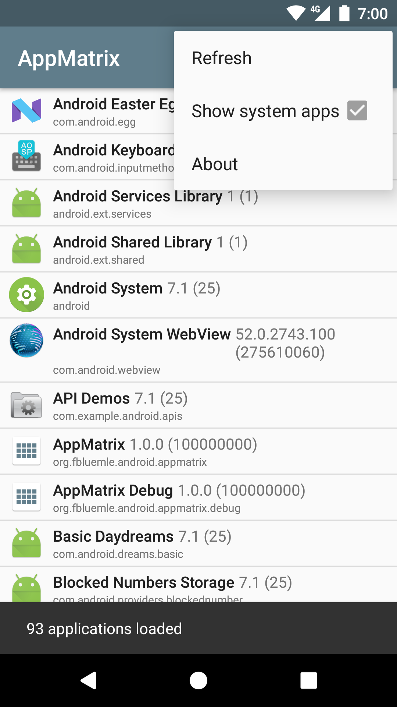

# AppMatrix

[![Build Status][1]][2]
[![Coverage Status][3]][4]

A simple utility app that lists all your installed apps (optionally including system apps), with
detailed version information.

## Future plans

The first version will only list local apps on the current device. The preliminary plan for version
2 is to have a true app "matrix", i.e. an overview of all apps installed across multiple devices,
synced to the user's Google account.

## License

    Copyright 2017 Frieder Bluemle

    Licensed under the Apache License, Version 2.0 (the "License");
    you may not use this file except in compliance with the License.
    You may obtain a copy of the License at

        http://www.apache.org/licenses/LICENSE-2.0

    Unless required by applicable law or agreed to in writing, software
    distributed under the License is distributed on an "AS IS" BASIS,
    WITHOUT WARRANTIES OR CONDITIONS OF ANY KIND, either express or implied.
    See the License for the specific language governing permissions and
    limitations under the License.

[1]: https://travis-ci.org/friederbluemle/appmatrix.svg?branch=master
[2]: https://travis-ci.org/friederbluemle/appmatrix
[3]: https://coveralls.io/repos/github/friederbluemle/appmatrix/badge.svg?branch=master
[4]: https://coveralls.io/github/friederbluemle/appmatrix?branch=master
