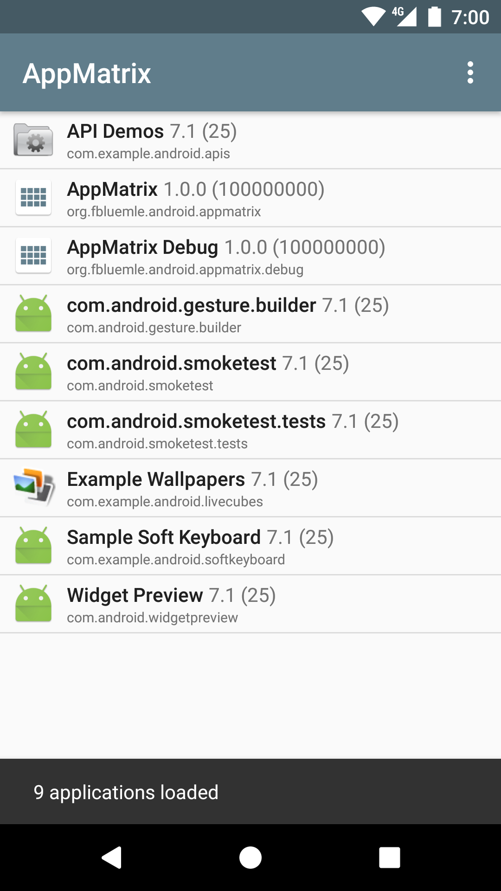
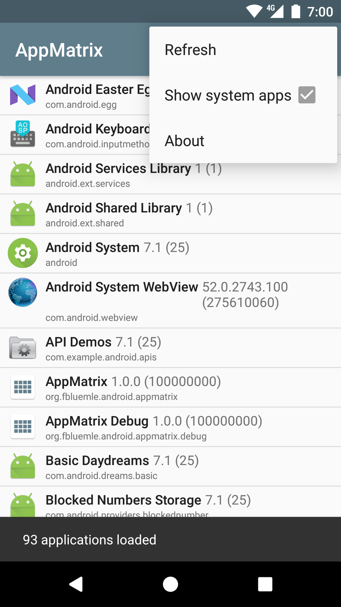

# AppMatrix

### List and manage your installed apps

A simple utility app that lists all your installed apps (optionally including system apps), with detailed version information.

More features will be added soon and contributions are welcome.

This app is free and open source
[https://github.com/friederbluemle/appmatrix](https://github.com/friederbluemle/appmatrix)

